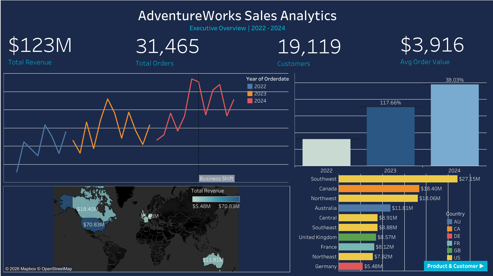
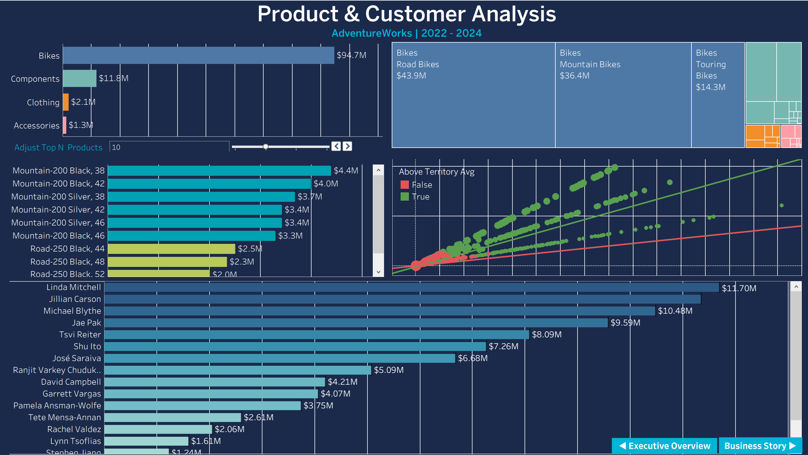

# AdventureWorks Sales Analytics

I built this project to demonstrate a full data analytics workflow, starting from loading raw data into a cloud database and ending with a published interactive Tableau dashboard. The dataset is the Microsoft AdventureWorks sample database, which covers sales operations for a fictional bicycle company called Adventure Works Cycles.

The analysis covers 31,465 orders and $123M in revenue across 2022 to 2024.

## Live Dashboard
[View on Tableau Public](https://public.tableau.com/views/AdventureWorksSalesAnalytics2022-2024/ExecutiveOverview)

## Dashboard Preview

### Executive Overview


### Product & Customer Analysis



## Tools Used

- **PostgreSQL** on Neon (cloud database — no local install needed)
- **DBeaver** for writing and testing SQL queries
- **Python** with pandas, matplotlib, seaborn, and SQLAlchemy
- **Microsoft Excel** for pivot tables and summary reporting
- **Tableau Desktop** for interactive dashboards
- **GitHub** for version control

## Project Structure

```
adventureworks-sales-analytics/
├── 01_exploration/     # Initial queries to understand the data
├── 02_analysis/        # Business analysis queries
├── 03_python/          # Data extraction, profiling, transformation, charts
├── 04_excel/           # Excel workbook with pivot tables and dashboard
├── 05_tableau/         # Tableau packaged workbook
└── README.md
```

## What I Was Trying to Answer

Before writing any queries I defined the business questions I wanted to explore:

- How did revenue grow year over year?
- Which territories and regions perform best?
- Which product categories drive the most revenue?
- Who are the top customers and how do they behave?
- Which salespersons generate the most revenue?
- What happened to average order value over time?
- What does the revenue forecast look like for the next 6 months?

## What I Found

**Revenue grew 200% in 3 years.** The business went from $16M in 2022 to $49M in 2024, with 2023 being the biggest growth year at +117%.

**Bikes drive almost everything.** 77% of total revenue ($94.7M) comes from bikes. Road Bikes alone account for 36% of all revenue. Accessories and Clothing have high order volumes but contribute very little financially.

**Something significant happened in July 2024.** Order volume more than doubled from one month to the next, but average order value fell from $7,702 to $3,160. This suggests the business shifted from high-value B2B orders toward a higher-volume retail model.

**North America dominates.** The Southwest territory leads at $27M. North America as a whole accounts for 72% of total revenue.

**Linda Mitchell is the top salesperson** at $11.7M in total revenue. Pamela Ansman-Wolfe has the highest average order value at around $35K per order.

**Tableau's forecast model projects** monthly revenue continuing toward $7M to $8M by late 2025.

## SQL Skills

I used PostgreSQL throughout. The queries cover joins across up to 4 tables, window functions like LAG and RANK, CTEs, CASE statements, date arithmetic, HAVING clauses, UNION ALL, and subqueries.

## Python Skills

I wrote four Python scripts: one to extract data from PostgreSQL and export to CSV and Excel, one to profile the data for quality issues, one to add calculated columns and customer segments, and one to generate exploratory charts using matplotlib and seaborn.

## Excel Skills

The Excel workbook has pivot tables with slicers, an interactive dashboard, conditional formatting, sparklines, and dynamic KPI cards using formulas linked to the data sheets.

## Tableau Skills

The Tableau workbook has 13 worksheets and 2 dashboards. I used line charts, bar charts, a filled map, treemap, scatter plot, histogram, and a text table. Other features include dual axis charts, reference lines, trend lines, forecasting, sets, bins, hierarchies, parameters, LOD expressions, table calculations, dashboard filter actions, story points, and navigation buttons.

## How the Data Was Loaded

The official Microsoft AdventureWorks CSV files use a mix of tab and custom delimiters that caused issues with standard COPY commands in PostgreSQL. I wrote a Python script using pandas and psycopg2 to handle the loading properly, including type casting for boolean, UUID, and nullable integer fields.

## Author

Wickrama | [LinkedIn](https://www.linkedin.com/in/wickrama) | [Tableau Public](https://public.tableau.com/app/profile/wickrama.wickramarachchi)

